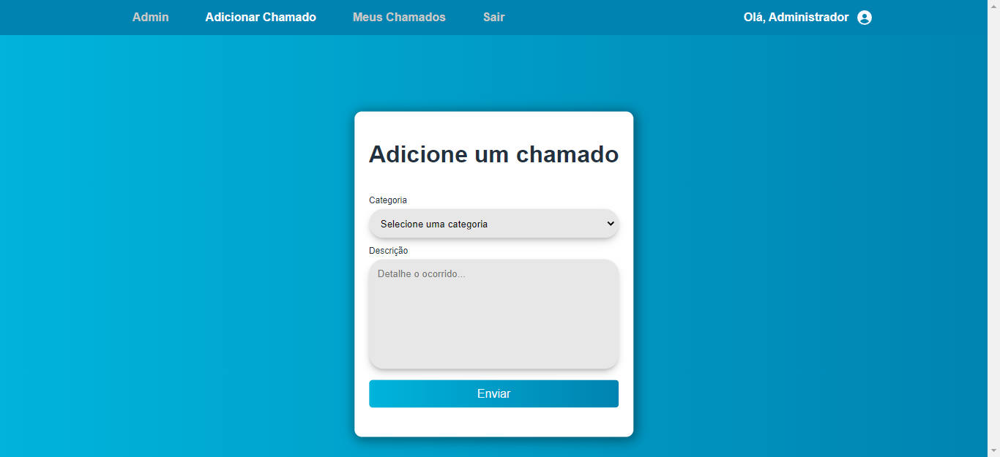

# Software para gerenciamento de chamados de TI



Este repositório contém um projeto de software para gerenciamento de chamados, desenvolvido como parte do meu trabalho acadêmico na faculdade. O objetivo do software é fornecer uma solução eficiente e organizada para o controle e acompanhamento de chamados em uma empresa ou organização.

## Funcionalidades

- Cadastro de usuário: O usuário pode criar uma conta fornecendo informações como por exemplo: matrícula, email, nome, departamento. <br/>
- Cadastro de chamados: O usuário pode criar e registrar novos chamados, fornecendo informações detalhadas sobre o problema ou solicitação. <br/>
- Histórico e relatórios: O sistema mantém um histórico completo de todos os chamados registrados, permitindo uma análise posterior e a geração de relatórios para avaliar o desempenho e a produtividade da equipe de suporte. <br/>
- Interface para Administrador: Os administradores (técnicos) possuem acesso a uma interface exclusiva onde é possível visualizar, excluir ou editar um chamado, além de poder tornar um usuário padrão em um admin. <br/>
<br/>
Deixei criado por padrão um usuário com permissão de administrador. <br/>
- Email: departamentoti@email.com <br/>
- Senha: 123456 <br/>

## Técnologias Utilizadas

- Linguagem de Programação: Python; <br/>
- Framework: Flask; <br/>
- Banco de Dados: SQLalchemy - SQlite3; <br/>

## Instalação

1. Clone ou baixe este repositório em sua máquina local
2. Acesse o diretório do projeto
3. Instale as dependências necessárias: ```pip install -r requirements.txt```
4. Configure as variáveis de ambiente necessárias, como as credenciais do banco de dados ou outras configurações específicas do seu ambiente.
5. Inicie o servidor: ```py main.py```
6. Acesse o software pelo seu navegador em [http://127.0.0.1:5000](http://127.0.0.1:5000)
